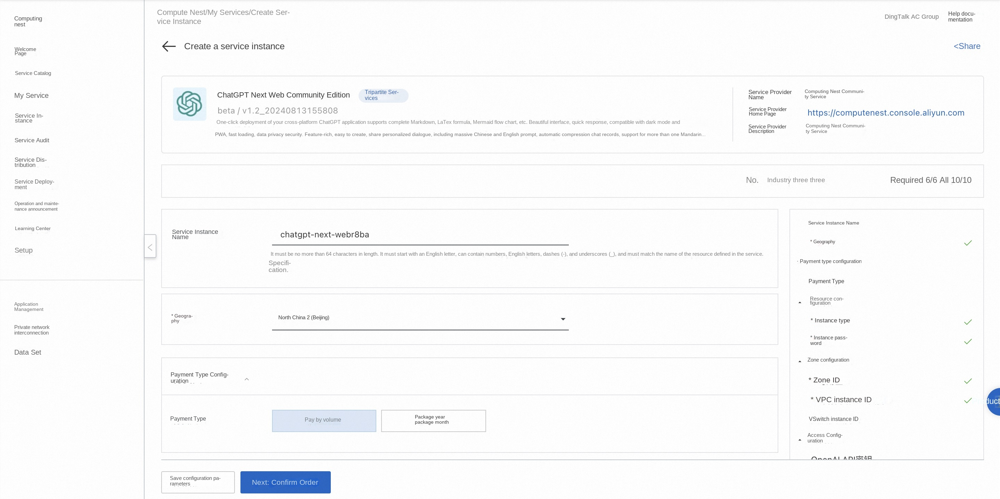
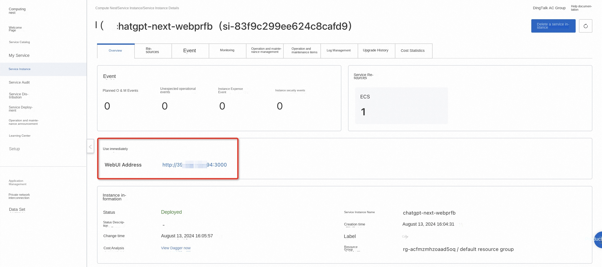
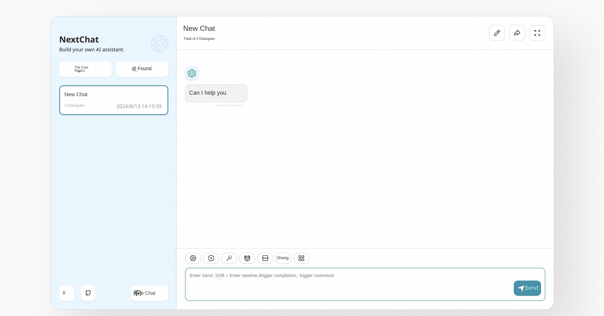

# ChatGPT Next Web Community Edition Rapid Deployment

## Overview
One-click deployment of your cross-platform ChatGPT applications, supporting complete Markdown, LaTex formulas, Mermaid flowcharts, and more. Beautiful interface, quick response, compatible with dark mode and PWA, fast loading, data privacy security. Feature-rich, easy to create, share personalized dialogue, including a large number of Chinese and English prompt, automatic compression chat records, support for multiple languages. For more information, see [ChatGPT Next Web official website](https://github.com/ChatGPTNextWeb/ChatGPT-Next-Web).

## Billing Description
Fees ChatGPT on the Next Web Community Edition are primarily related:

-Selected vCPU and memory specifications
-System disk type and capacity
-public network bandwidth

## Permissions required for RAM accounts
To deploy ChatGPT Next Web Community Edition, you need to access and create some Alibaba Cloud resources. Therefore, your account must contain permissions for the following resources.
**Note**: This permission is required only when your account is a RAM account.

| Permission policy name | Comment |
| ------------------------------------- | ---------------------------- |
| AliyunECSFullAccess | Permissions to manage ECS instances |
| AliyunVPCFullAccess | Permissions to manage a VPC |
| AliyunROSFullAccess | Manage permissions for Resource Orchestration Service (ROS) |
| AliyunComputeNestUserFullAccess | Manage user-side permissions for the compute nest service (ComputeNest) |

## Deployment process
1. Visit the ChatGPT Next Web Community Service [Deployment Link](https://computenest.console.aliyun.com/service/instance/create/cn-hangzhou?type=user&ServiceId=service-f1c9b75e59814dc49d52) and fill in the deployment parameters as prompted:

2. After completing the parameters, you can see the corresponding RFQ details. After confirming the parameters, click **Next: Confirm Order**. Confirm the order and agree to the service agreement and click **Create Now** to enter the deployment phase.

4. After the deployment is completed, enter the service instance management and find the ChatGPT Next Web service access link in the console.

5. Click the link to access the service.

